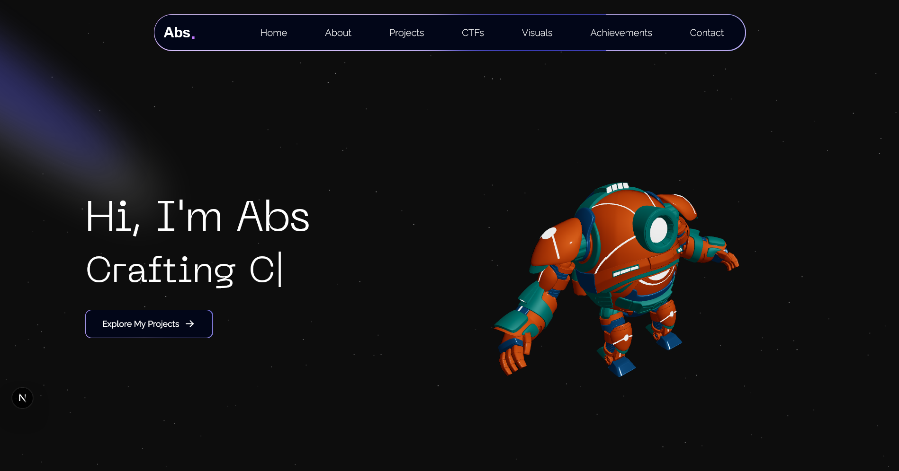

# ABS Portfolio

A modern, interactive portfolio website showcasing Abu Bakar Siddique's expertise in cybersecurity, software development, and competitive programming. Built with Next.js 15, TypeScript, and Three.js for stunning 3D visualizations.

## 🌐 Live Demo

**Experience the portfolio live**: [https://abs-portfolio-ten.vercel.app/](https://abs-portfolio-ten.vercel.app/)


## 🎥 Video Preview

<video src="screenshots/website_demo.mp4" controls width="700"></video>

*If the video does not play, [download it here](screenshots/website_demo.mp4)*


## 🛠️ Tech Stack

### Frontend
- **Next.js 15** - React framework with App Router
- **TypeScript** - Type-safe development
- **Tailwind CSS 4** - Utility-first CSS framework
- **Three.js** - 3D graphics and animations
- **React Three Fiber** - React renderer for Three.js
- **React Three Drei** - Useful helpers for React Three Fiber

### UI & Animations
- **Framer Motion** - Smooth animations and transitions
- **Lucide React** - Beautiful icons
- **React Icons** - Extensive icon library
- **React Typed** - Typewriter effect animations

### Additional Tools
- **Sentry** - Error monitoring and performance tracking
- **ESLint** - Code linting and formatting
- **PostCSS** - CSS processing

## 📁 Project Structure

```
abs-portfolio/
├── app/                    # Next.js app directory
│   ├── page.tsx           # Home page
│   ├── layout.tsx         # Root layout
│   ├── globals.css        # Global styles
│   └── api/               # API routes
├── components/            # React components
│   ├── About.tsx          # About section
│   ├── Hero.tsx           # Hero section
│   ├── RecentProjects.tsx # Projects showcase
│   ├── Ctf.tsx            # CTF achievements
│   ├── Achievements.tsx   # Awards and recognitions
│   ├── Contact.tsx        # Contact information
│   ├── Visuals.tsx        # Visual portfolio
│   ├── Robot.tsx          # 3D robot component
│   └── ui/                # Reusable UI components
├── data/                  # Static data and configurations
├── lib/                   # Utility functions
├── public/                # Static assets
│   ├── projects/          # Project screenshots
│   ├── achievements/      # Achievement images
│   ├── visuals/           # Visual portfolio images
│   └── robot_rocket.glb   # 3D model files
└── screenshots/           # Application screenshots
```

## 🚀 Getting Started

### Prerequisites
- Node.js 18+ 
- npm, yarn, pnpm, or bun

### Installation

1. Clone the repository:
```bash
git clone https://github.com/Abs-Futy7/abs-portfolio.git
cd abs-portfolio
```

2. Install dependencies:
```bash
npm install
# or
yarn install
# or
pnpm install
```

3. Run the development server:
```bash
npm run dev
# or
yarn dev
# or
pnpm dev
# or
bun dev
```

4. Open [http://localhost:3000](http://localhost:3000) in your browser to see the result.

## 📱 Scripts

- `npm run dev` - Start development server
- `npm run build` - Build for production
- `npm run start` - Start production server
- `npm run lint` - Run ESLint

## 🎨 Customization

### Adding New Projects
Edit `data/index.ts` and add your project to the `projects` array:

```typescript
{
  id: 7,
  title: "Your Project Name",
  description: "Project description",
  link: "https://your-project-link.com",
  img: "/projects/your-image.png",
  tags: ["Next.js", "TypeScript", "Tailwind CSS"]
}
```

### Modifying Sections
Each section has its own component in the `components/` directory. Customize the content and styling as needed.

### Adding 3D Models
Place your `.glb` files in the `public/` directory and import them in the relevant components.

## 🌟 Features in Detail

- **Responsive Design**: Optimized for desktop, tablet, and mobile devices
- **3D Interactions**: Interactive robot model with animations
- **Smooth Animations**: Framer Motion powered transitions
- **Modern Typography**: Custom font integration
- **Performance Optimized**: Lazy loading and image optimization
- **SEO Friendly**: Proper meta tags and structured data
- **Error Monitoring**: Sentry integration for production monitoring

## 📸 Screenshots



## 🤝 Contributing

1. Fork the repository
2. Create your feature branch (`git checkout -b feature/AmazingFeature`)
3. Commit your changes (`git commit -m 'Add some AmazingFeature'`)
4. Push to the branch (`git push origin feature/AmazingFeature`)
5. Open a Pull Request

## 📄 License

This project is licensed under the MIT License - see the [LICENSE](LICENSE) file for details.

## 📞 Contact

**Md. Abu Bakar Siddique**
- GitHub: [@Abs-Futy7](https://github.com/Abs-Futy7)
- LinkedIn: [MD Abu Bakar Siddique](https://www.linkedin.com/in/md-abu-bakar-siddique-59b881237/)
- Facebook: [Abu Bakar Siddique](https://fb.com/abu%20bakar%20siddique%20(abs))

## 🙏 Acknowledgments

- **Next.js Team** for the amazing framework
- **Vercel** for hosting and deployment
- **Three.js Community** for 3D graphics capabilities
- **Open Source Contributors** for the fantastic libraries used

---

⭐ **Star this repository if you found it helpful!**

**Live Demo**: [Visit Portfolio](https://abs-portfolio-ten.vercel.app/)
